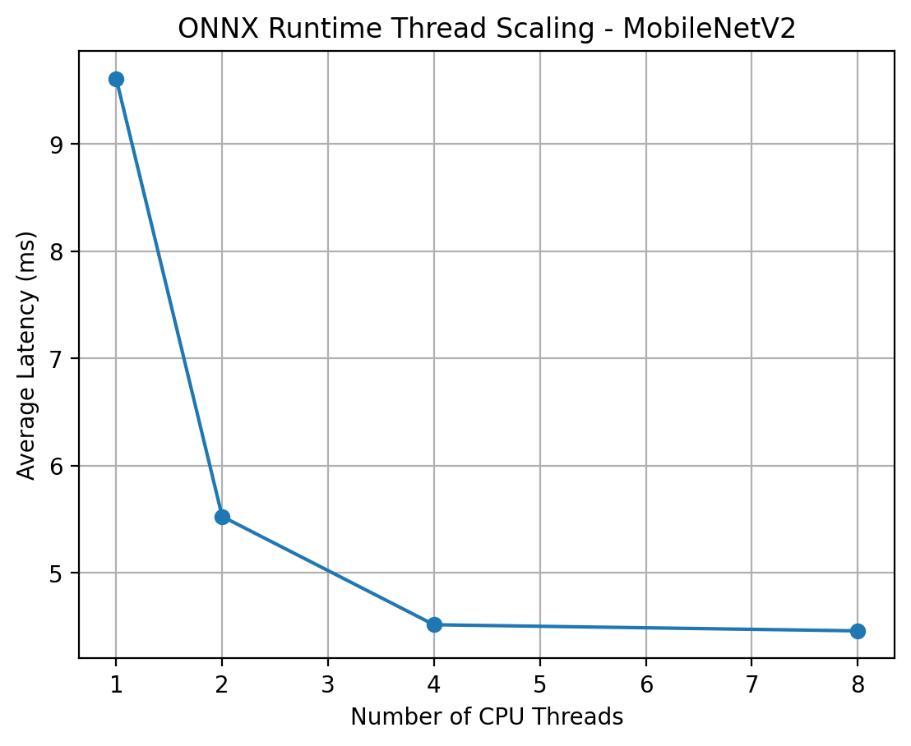
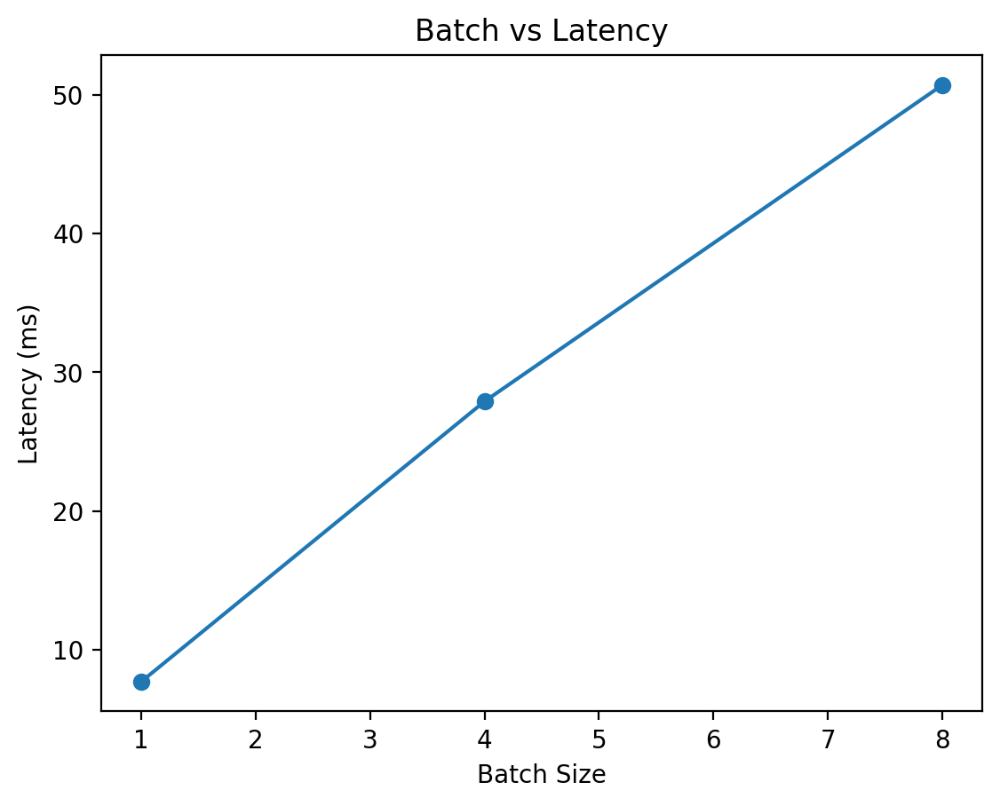
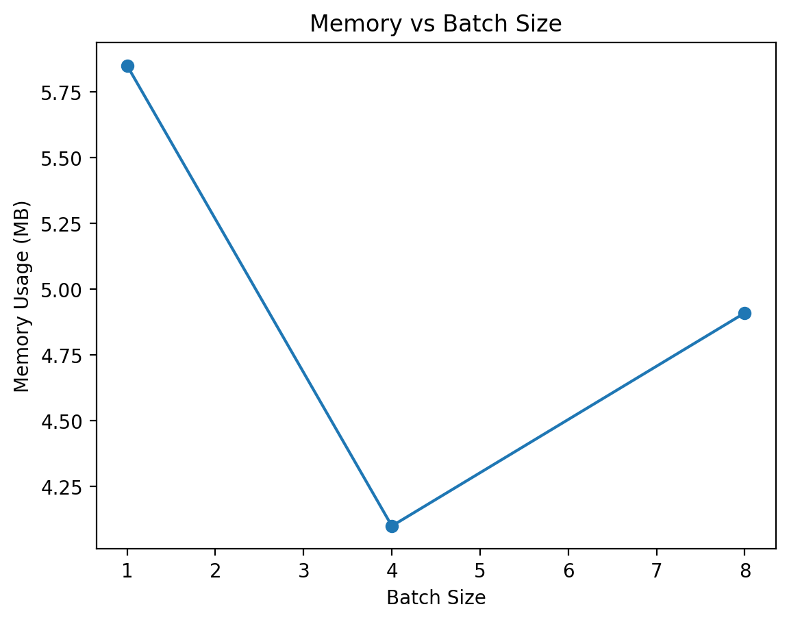
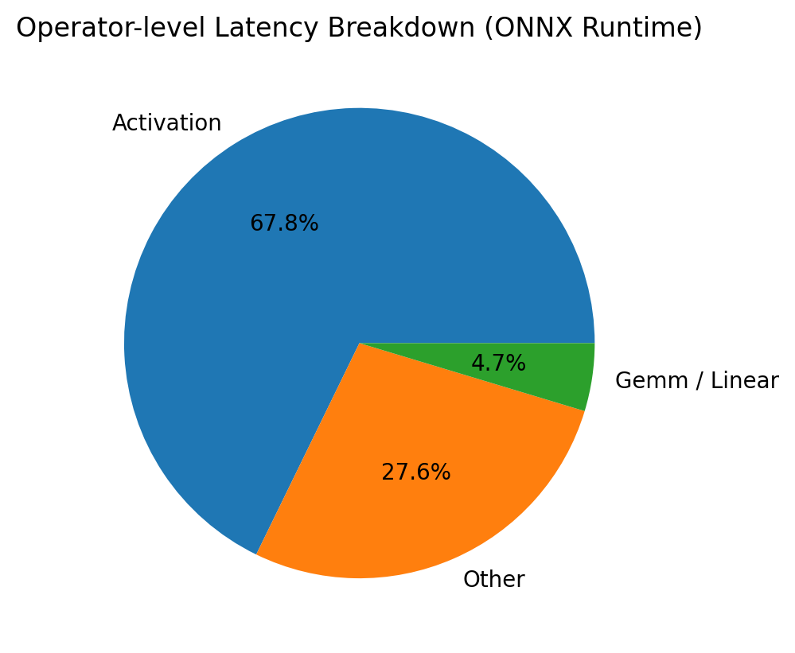

# Edge AI Inference Optimization & Profiling Pipeline

## Overview

This project implements an end-to-end edge AI inference optimization and profiling pipeline.

The goal is to simulate a real-world AI deployment workflow and analyze how model architecture, runtime systems, and hardware constraints affect performance.

Key focus areas include:

- Multi-runtime comparison (PyTorch, TorchScript, ONNX Runtime)
- System-level performance profiling (latency, throughput, memory)
- Operator-level analysis
- Roofline modeling (memory-bound vs compute-bound)
- Debug and root cause analysis
- Deployment trade-offs (batch, threading)
- Tooling and automation

---

## System Pipeline

```text
PyTorch Model
    ↓
ONNX Export
    ↓
Graph Optimization
    ↓
Quantization (INT8)
    ↓
ONNX Runtime Inference (Python + C++)
    ↓
Profiling & Analysis
```

---

## Multi-Runtime Comparison

| Runtime | Avg Latency (ms) | Throughput (QPS) |
|--------|----------------|----------------|
| PyTorch | ~26 ms | ~38 |
| TorchScript | ~20 ms | ~50 |
| ONNX Runtime (optimized) | ~4.5 ms | ~220 |

### Insight

- TorchScript reduces Python overhead compared to PyTorch
- ONNX Runtime achieves the best performance due to graph optimization and optimized kernels

This demonstrates the importance of selecting the right runtime in an AI software toolchain.

---

## Thread Scaling



### Insight

- Latency improves significantly from 1 → 4 threads
- Performance saturates beyond 4 threads

This indicates diminishing returns due to system-level constraints.

---

## Batch vs Latency Trade-off



| Batch | Latency (ms) | QPS |
|------|-------------|-----|
| 1 | 7.7 | 129 |
| 4 | 27.9 | 143 |
| 8 | 50.7 | 158 |

### Insight

- Throughput increases slightly with batch size
- Latency increases almost linearly

Conclusion:

Batching improves throughput but is not suitable for real-time edge inference.

---

## Memory Profiling



### Insight

- Memory usage varies with batch size
- Higher workload increases data movement and buffering

This suggests memory bandwidth pressure.

Combined with latency behavior, this confirms the system is memory-bound rather than compute-bound.

---

## Operator-level Profiling



Top latency contributors:

- Activation: ~68%
- Other (including fused Conv kernels): ~28%
- GEMM / Linear: ~5%

### Insight

- Activation dominates runtime
- GEMM contributes minimally

This indicates the workload is memory-bound.

Some convolution operations are fused into optimized kernels and appear under "Other".

---

## Roofline-based Analysis

Applied Roofline modeling to the ONNX inference pipeline to identify whether bottlenecks were memory-bound or compute-bound.

### Operator Mapping

- Activation / Conv → Memory-bound
- GEMM / Linear → Compute-bound

### Insight

- Thread scaling saturation
- Activation-dominated workload
- Limited benefit from additional compute

Conclusion:

The system is constrained by memory bandwidth rather than compute throughput.

---

## Debug / Failure Analysis: INT8 Quantization

### Observations

- Latency increased significantly (~20x)
- Throughput decreased
- Accuracy consistency dropped (~100% → 3%)

### Root Cause

- MobileNetV2 is convolution-heavy
- Quantized convolution is not efficiently supported in ONNX Runtime CPU backend
- Activation-heavy architecture amplifies memory-bound behavior

### Resolution

- Switched back to optimized FP32 ONNX
- Avoided INT8 dynamic quantization for CNN workloads

### Engineering Insight

Identified and resolved a performance regression issue in quantized inference.

Quantization effectiveness depends on model architecture, runtime backend, and operator support.

---

## Engineering Decisions

- Selected 4-thread configuration as optimal due to diminishing returns
- Avoided INT8 dynamic quantization for CNN workloads
- Prioritized ONNX Runtime for deployment performance
- Built a reusable benchmarking tool for experimentation
- Validated inference using both Python and C++ runtimes

---

## Benchmark Tool (CLI)

```powershell
python run_pipeline.py --threads 4 --batch 1
```

### Purpose

Provides a reusable tool to evaluate different inference configurations.

Simulates real-world AI software toolchains and deployment scenarios.

---

## C++ ONNX Runtime Inference

- Built using ONNX Runtime C++ API and CMake
- Runs inference without Python overhead
- Validates deployment-level performance

---

## Platform Awareness

This pipeline is designed to be portable across platforms such as Linux and embedded systems.

The same methodology can be extended to mobile SoCs (CPU / NPU) using vendor-specific runtimes such as Qualcomm QNN.

---

## Key Takeaway

Efficient AI deployment requires system-level optimization across:

- Model format
- Runtime engine
- Hardware constraints

Not just model accuracy.

---

## Reproduce

```powershell
python scripts/export_onnx.py
python scripts/optimize_onnx.py
python scripts/benchmark.py --backend onnx --threads 4
python scripts/thread_sweep.py
python scripts/plot_thread_sweep.py
python scripts/plot_batch_scaling.py
python scripts/plot_memory_scaling.py
python scripts/benchmark_torchscript.py
python run_pipeline.py --threads 4 --batch 1
```